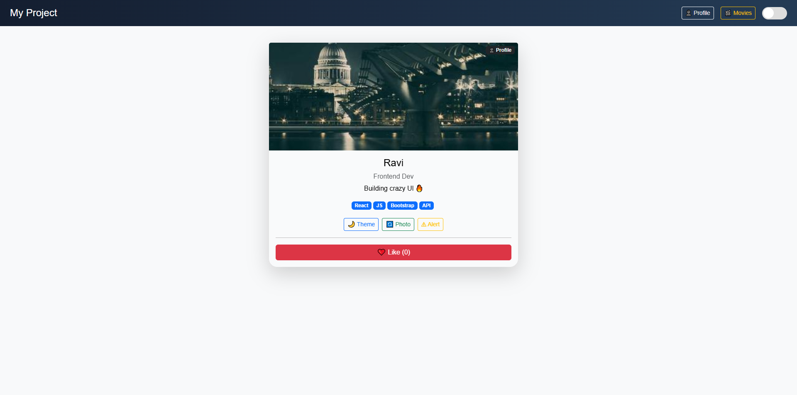

# 🚀 React Portfolio + Movie App

A modern **React + Vite** web application that combines a **Personal Portfolio Dashboard** 
with a **Movie Search & Favourite App** using the TMDB API.

---

## 📌 Project Overview

This project is divided into two main parts:

### 👤 Portfolio Card

* Displays personal profile information
* Dynamic skills rendering using props
* Interactive UI with:

  * Theme toggle (Dark/Light 🌙☀️)
  * Profile image switch
  * Alert button
  * Like counter ❤️

---

### 🎬 Movie App

* Fetches real-time movie data from TMDB API
* Shows trending movies on load
* Search movies dynamically
* Add/Remove favourite movies ⭐
* Separate section for favourite movies

---

## 🖼️ Features

✅ Modern UI with Bootstrap
✅ Responsive layout (Mobile + Desktop)
✅ Dark / Light mode
✅ Real API integration (TMDB)
✅ Dynamic rendering using React props
✅ State management using React Hooks
✅ Conditional rendering
✅ Clean component structure

---

## 🛠️ Tech Stack

* **Frontend:** React (Vite)
* **Styling:** Bootstrap 5
* **API:** TMDB (The Movie Database)
* **State Management:** React Hooks (useState, useEffect)

---

## 📂 Folder Structure

```
src/
│
├── components/
│   ├── Navbar.jsx
│   ├── ProfileCard.jsx
│   ├── SkillBadge.jsx
│   ├── ThemeToggle.jsx
│
├── movie/
│   ├── MovieApp.jsx
│   ├── MovieCard.jsx
│
├── App.jsx
└── main.jsx
```

---

## ⚙️ Setup Instructions

### 1️⃣ Clone Repository

```bash
git clone https://github.com/ravimajithiya1205-coder/react-essentials-assignment
cd react-essentials-assignment
cd Assignment-1

```

---

### 2️⃣ Install Dependencies

```bash
npm install
```

---

### 3️⃣ Add Environment Variable

Create a `.env` file in root:

```env
VITE_TMDB_KEY=API_KEY
```

👉 Get API key from https://www.themoviedb.org/

---

### 4️⃣ Run Project

```bash
npm run dev
```

---

## 🌐 Deployment

This project is deployed on **Vercel**

👉 Live URL:

```
https://react-essentials-assignment-seven.vercel.app/
```

---

## 📸 Screenshots

assets/
    screenshot/
        profileDashboard.png
        moviesDashboard.png


 


---

## 🎯 Usage

* Click **Profile** → View personal card
* Click **Movies** → Browse & search movies
* Use search bar to find movies
* Click ⭐ to add/remove favourites

---

## ⚠️ Important Notes

* API key must be added in `.env`
* Do NOT expose API keys publicly
* Restart server after adding `.env`

---

## 🚀 Future Improvements

* 🎥 Movie trailer popup
* 🔄 Infinite scroll
* 🎨 Advanced animations (Framer Motion)
* 📱 Better mobile UI
* 🌍 Multi-language support

---

## 🤝 Contributing

Feel free to fork this project and improve it!

---

## 📧 Author

**Ravi Majithiya**
Frontend Developer 💻
Passionate about building modern UI with React 🚀

---

## ⭐ Support

If you like this project:
👉 Give it a ⭐ on GitHub
---
