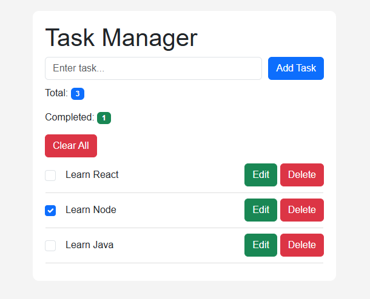
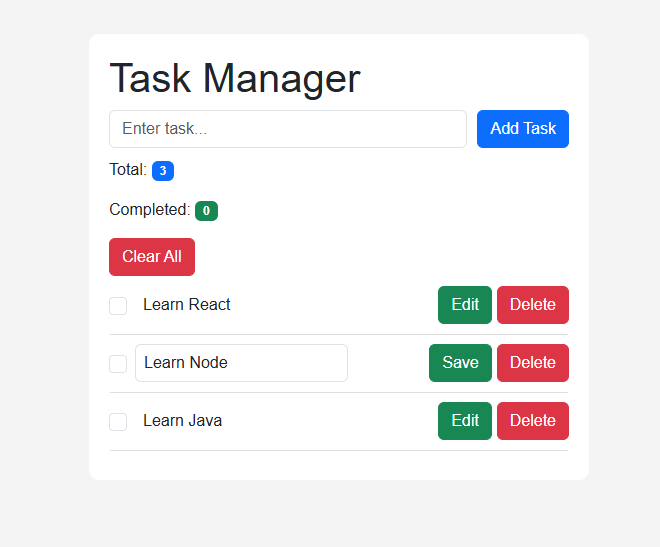

# 📝 Task Manager Application

A modern **Task Manager App** built using **React, Context API, and useReducer** for efficient global state management. This application allows users to manage their daily tasks with a clean and responsive UI powered by Bootstrap.

---

## 🚀 Live Demo

https://react-essentials-assignment-assignm.vercel.app/

---

## 📦 GitHub Repository

```bash
git clone https://github.com/your-username/react-essentials-assignment.git
cd react-essentials-assignment
cd Assignment-2
npm install
npm start
```

---

## 🧠 Features

* ➕ Add new tasks
* ✏️ Edit existing tasks
* ❌ Delete tasks
* ✔️ Mark tasks as complete/incomplete
* 🧹 Clear all tasks
* 📊 Task summary (Total & Completed)
* 🌍 Global state using Context API
* ⚙️ State management using useReducer
* 🎨 Responsive UI with Bootstrap

---

## 🛠️ Tech Stack

* React.js
* Context API
* useReducer Hook
* Bootstrap 5

---

## 📂 Project Structure

```
src/
│
├── context/
│   ├── TaskContext.jsx
│   ├── taskReducer.js
│
├── components/
│   ├── TaskInput.jsx
│   ├── TaskList.jsx
│   ├── TaskItem.jsx
│   ├── TaskSummary.jsx
│
├── App.jsx
├── index.css
```

---

## ⚙️ Installation & Setup

1. Clone the repository

```bash
git clone https://github.com/your-username/react-essentials-assignment.git
```

2. Navigate to project folder

```bash
cd react-essentials-assignment
cd Assignment-2
```

3. Install dependencies

```bash
npm install
```

4. Run the app

```bash
npm start
```

---

## 🎨 UI Highlights

* Clean and minimal design
* Fully responsive layout
* Interactive buttons and hover effects
* Completed tasks are greyed out with strike-through

---

## 📸 Screenshots

assets/
    screenshot/
        TaskManager.png
        TaskComplete.png


 



---

## 🤝 Contributing

Feel free to fork this project and improve it!

---

## 📧 Author

**Ravi Majithiya**
Frontend Developer 💻
Passionate about building modern UI with React 🚀

---

## ⭐ Support

If you like this project:
👉 Give it a ⭐ on GitHub
---
