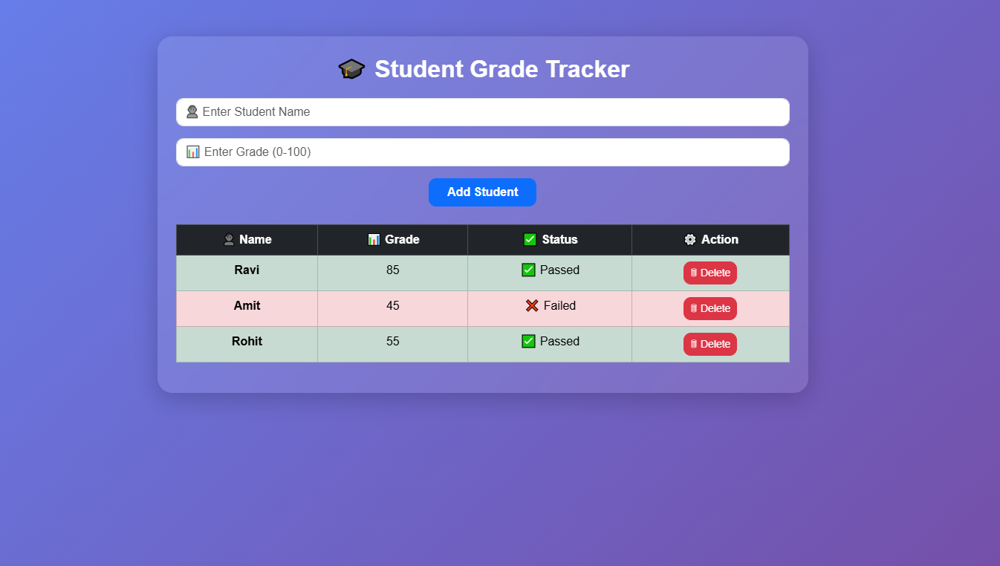

# 🎓 Student Grade Tracker Application

A modern and interactive **Student Grade Tracker** built using **React Class-Based Components** and **React Lifecycle Methods**, enhanced with a clean and attractive UI using **Bootstrap 5**.

---

## 🚀 Live Demo

👉 https://react-essentials-assignment-grade.vercel.app/

---

## 📌 Project Overview

This project is designed to demonstrate the use of **React Class-Based Components** and core lifecycle methods. It allows users to manage student records, track grades, and visualize pass/fail status with a modern UI.

---

## ✨ Features

* 👤 Add new students with name and grade
* 📊 Display student list in a structured table
* ✅ Automatic Pass/Fail status
* 🎨 Dynamic row coloring (Green = Passed, Red = Failed)
* 🗑️ Delete student functionality
* ⚡ Real-time UI updates using `setState()`
* 🔄 Lifecycle methods usage
* 💎 Modern UI with Bootstrap 5 + Glass Design
* 📱 Fully responsive layout

---

## 🛠️ Tech Stack

* **React.js (Class Components)**
* **Bootstrap 5 (React-Bootstrap)**
* **CSS (Custom Styling - Glass UI)**

---

## 📁 Folder Structure

```
src/
│
├── components/
│   ├── StudentList.jsx
│   ├── StudentItem.jsx
│
├── App.jsx
├── App.css
├── main.jsx
```

---

## ⚙️ Installation & Setup

### 1️⃣ Clone the Repository

```
git clone https://github.com/your-username/react-essentials-assignment.git
```

### 2️⃣ Navigate to Project Folder

```
cd react-essentials-assignment
cd Assignment-4
```

### 3️⃣ Install Dependencies

```
npm install
```

### 4️⃣ Install Bootstrap

```
npm install react-bootstrap bootstrap
```

---

## ▶️ Run the Project

```
npm run dev
```

---

## ⚡ React Lifecycle Methods Used

### ✅ `componentDidMount()`

* Loads initial sample student data

### ✅ `componentDidUpdate()`

* Detects changes in student list
* Logs updates to console

### ✅ `componentWillUnmount()`

* Handles cleanup when component is removed

---

## 🧠 State Management

* Managed using `this.state`
* Updated via `setState()`
* Handles:

  * Student list
  * Form inputs (name & grade)

---

## 📝 Form Handling

* Controlled components using `this.state`
* Input validation:

  * Grade must be between **0–100**
* Clears form after submission

---

## 🎨 UI Enhancements

* 🌈 Gradient background
* 🧊 Glassmorphism card design
* 📊 Styled table with Bootstrap
* 🎯 Icons for better UX
* 💡 Hover & responsive design

---

## 🖼️ Screenshots

### 🎓 Dashboard UI

assets/
    screenshot/
        StudentGradeDashboard.png

 

---

### Steps:

1. Build the project:

```
npm run build
```

## 📸 Add Images in README

```

```

---

## 🤝 Contributing

Contributions are welcome! Feel free to fork this repository and improve the project.

---

## 📄 License

This project is free for learning and educational purposes.

---

## 👨‍💻 Author

**Ravi Majithiya**
Frontend Developer 💻
Passionate about building modern UI with React 🚀

---

## ⭐ Support

If you like this project:

* ⭐ Star this repository
* 🔁 Share with others

---

🔥 *Built with React Class Components & Modern UI Design*
