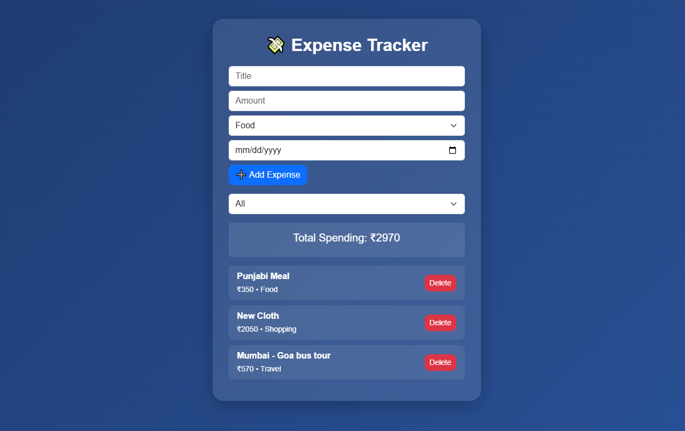
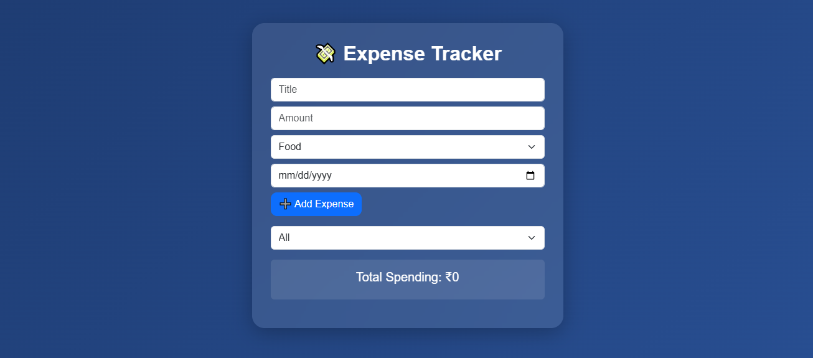

# 💸 Personal Expense Tracker (Custom Hooks + LocalStorage)

## 📌 Introduction

The **Personal Expense Tracker** is a React-based web application designed to manage daily expenses efficiently. This project focuses on implementing **Custom Hooks**, **LocalStorage integration**, and **modular architecture** to separate business logic from UI components.

It demonstrates how modern React applications can be structured for **scalability, reusability, and maintainability**.

---

## 🚀 Live Demo

👉 https://react-essentials-assignment-expens.vercel.app/

---

## 🚀 Features

* ➕ Add new expenses (title, amount, category, date)
* 🗑️ Delete expenses
* 📋 Dynamic expense listing
* 💾 Data persistence using LocalStorage
* 🔍 Filter expenses by category
* 📊 Total expense summary
* ♻️ Reusable Custom Hooks
* 🧠 Clean separation of logic and UI

---

## 🛠️ Tech Stack

* React JS
* JavaScript (ES6+)
* Bootstrap 5
* LocalStorage API

---

## 📁 Project Structure

```
src/
│
├── components/
│   ├── ExpenseForm.jsx
│   ├── ExpenseList.jsx
│   ├── Filters.jsx
│   ├── Summary.jsx
│
├── hooks/
│   ├── useExpenses.js
│   ├── useLocalStorage.js
│   ├── useForm.js
│
├── App.jsx
├── main.jsx
```

---

## 🧠 Custom Hooks Overview

### 🔹 useForm()

Manages form input state and handles changes efficiently.

### 🔹 useExpenses()

Handles:

* Adding expenses
* Deleting expenses
* Managing expense state

### 🔹 useLocalStorage()

* Saves data in browser storage
* Loads data on page refresh
* Keeps UI and storage in sync

---

## 📊 Functionality Breakdown

### 1️⃣ Add Expense

Users can enter:

* Title
* Amount
* Category
* Date

### 2️⃣ Display Expenses

* All expenses are listed dynamically
* Data updates instantly

### 3️⃣ Delete Expense

* Remove any expense from the list

### 4️⃣ Data Persistence

* Expenses are stored in **LocalStorage**
* Data remains even after page reload

### 5️⃣ Filtering

* Filter expenses based on category

### 6️⃣ Summary

* Displays total spending amount

---

## ⚙️ Installation & Setup

```bash
# Clone the repository
git clone https://github.com/ravimajithiya1205-coder/react-essentials-assignment

# Navigate to project folder
cd Assignment-5

# Install dependencies
npm install

# Run the project
npm run dev
```

---

## 🌐 Live Demo

🔗 https://react-essentials-assignment-expens.vercel.app/

---

## 📦 GitHub Repository

🔗 https://github.com/ravimajithiya1205-coder/react-essentials-assignment

---

## 🖼️ Screenshots

assets/
    screenshot/
        ExpensList.png
        ExpensTracker.png

 
 

---

## ✨ Future Enhancements

* 📅 Date range filtering
* 🔍 Search functionality
* 📊 Charts (Expense Analytics)
* 🔃 Sorting (amount/date/category)
* 🌙 Dark mode UI
* 📁 Export data (CSV)

---

## 🎯 Learning Outcomes

By completing this project, you will:

* Understand **Custom Hooks in React**
* Learn **state management patterns**
* Implement **LocalStorage persistence**
* Build **modular and reusable code**
* Improve **real-world project structuring skills**

---

## 📄 License

This project is free for learning and educational purposes.

---

## 👨‍💻 Author

**Ravi Majithiya**
Frontend Developer 💻
Passionate about building modern UI with React 🚀

---

## ⭐ Support

If you like this project:

* ⭐ Star this repository
* 🔁 Share with others

---
