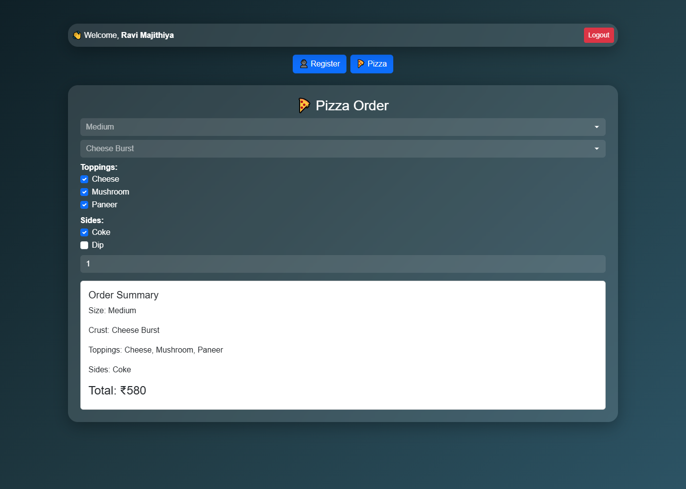
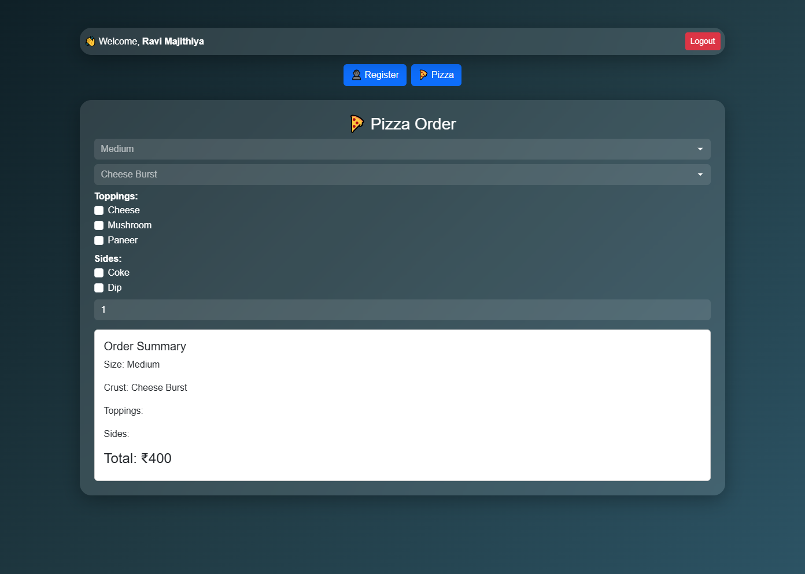
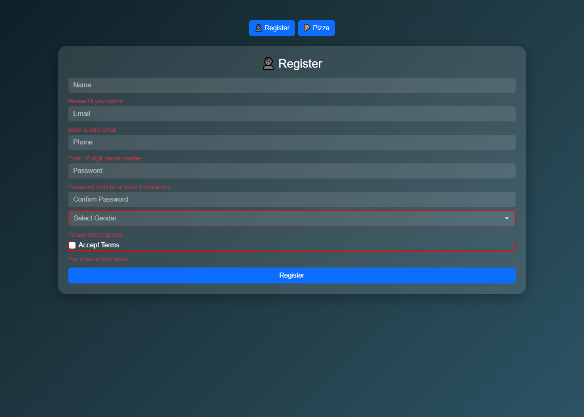
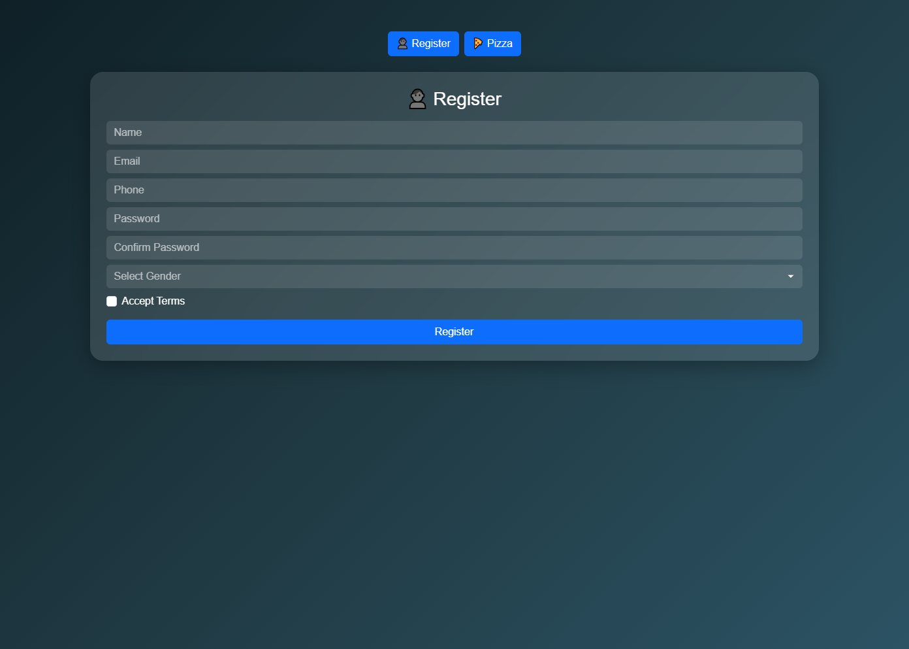

# 🍕 User Registration & Mario's Pizza Ordering App

A modern React application that combines a **User Registration System** and an **Interactive Pizza Ordering Platform**.
This project demonstrates form handling, validation, state management, and dynamic UI updates using React and Bootstrap.

---

## 🚀 Features

### 👤 User Registration Form

* Real-time form validation
* Email format validation
* Password match & strength check
* Phone number validation (10 digits)
* Gender selection & Terms checkbox
* Error messages for each field
* Data stored in **localStorage**
* Success message on submission

---

### 🍕 Mario’s Pizza Ordering System

* Select pizza size (Small, Medium, Large)
* Choose crust type
* Add multiple toppings
* Add sides (Drinks, Dips)
* Quantity selection
* 💰 Automatic price calculation
* 📋 Live order summary

---

### ✨ Advanced Features

* 💎 Glass UI design (modern look)
* 🎨 Animated validation (input feedback)
* 💾 Data persistence using localStorage
* 👋 User name displayed after login
* 🔐 Logout functionality
* 🔄 Page navigation (Register → Pizza)

---

## 🛠️ Tech Stack

* ⚛️ React (Functional Components + Hooks)
* 🎨 Bootstrap 5
* 💅 Custom CSS (Glass UI)
* 💾 LocalStorage API

---

## 📁 Project Structure

```
src/
│
├── components/
│   ├── RegisterForm.jsx
│   ├── PizzaOrder.jsx
│
├── App.jsx
├── main.jsx
├── App.css
```

---


## 🌐 Live Demo

🔗 https://react-essentials-assignment-pizza.vercel.app/

---

## ⚙️ Installation & Setup

1. Clone the repository:

```
git clone https://github.com/ravimajithiya1205-coder/react-essentials-assignment
```

2. Navigate into the project:

```
cd react-essentials-assignment
cd module11-forms
```

3. Install dependencies:

```
npm install
```

4. Run the app:

```
npm run dev
```

---

## 🎯 Usage

1. Fill out the registration form
2. Submit (after validation passes)
3. Automatically redirected to Pizza Order page
4. Customize your pizza 🍕
5. View live price updates

---

## 🖼️ Screenshots

assets/
    screenshot/
        pizzaDashboard.png
        registerUserDashboard.png
        errorWithInput.png
        registerDashboard.png

 


 

---

## 💡 Learning Outcomes

* Controlled components in React
* Form validation techniques
* State management using useState
* Handling side effects
* LocalStorage integration
* Conditional rendering & navigation

---

## 🚀 Future Improvements

* 🔐 Authentication system (Login/Signup)
* 📄 Invoice generation (PDF)
* 📊 Order analytics dashboard
* 🌙 Dark/Light theme toggle
* 🌐 API integration

---
---

## 🤝 Contributing

Contributions are welcome! Feel free to fork this repository and improve the project.

---

## 📄 License

This project is free for learning and educational purposes.

---

## 👨‍💻 Author

**Ravi Majithiya**
Frontend Developer 💻
Passionate about building modern UI with React 🚀

---

## ⭐ Support

If you like this project:

* ⭐ Star this repository
* 🔁 Share with others

---

🔥 *Built with React Class Components & Modern UI Design*
